# ESPHome BLE Client for Powerdale Nexxtender EV Charger

This repository contains an ESPHome BLE client for interfacing with the Powerdale Nexxtender EV Charger. The client allows you to seamlessly integrate the Nexxtender charger with your ESPHome projects, enabling you to monitor and control the charger remotely via Bluetooth Low Energy (BLE). Additionally, it integrates smoothly with Home Assistant, providing a convenient interface for managing your Nexxtender charger within your home automation setup.

[](https://github.com/geertmeersman)
[](https://www.buymeacoffee.com/geertmeersman)
[](https://discord.gg/PTpExQJsWA)

[](https://discord.gg/PTpExQJsWA)

[](https://github.com/geertmeersman/nexxtender/blob/master/LICENSE)
[](https://github.com/geertmeersman/nexxtender/releases)
[](https://github.com/geertmeersman/nexxtender/releases)
[](https://github.com/geertmeersman/nexxtender/commits)
[](https://github.com/geertmeersman/nexxtender/graphs/contributors)
[](https://github.com/geertmeersman/nexxtender/commits/main)

[](https://github.com/geertmeersman/nexxtender/actions/workflows/esphome_build.yaml)

## Features

- **BLE Connectivity:** Establish a BLE connection between your ESPHome device and the Powerdale Nexxtender EV Charger for data exchange and control.

- **Real-time Monitoring:** Retrieve real-time data from the Nexxtender charger, including charging status, voltage, current, and power consumption.

- **Remote Control:** Control the Nexxtender charger remotely from your ESPHome device, enabling features such as starting, stopping, change charge mode, set the charger to Open/Private, set the maximum car charging speed and scheduling charging sessions.

- **Toggle open/private mode:** Toggle the open/private mode of the charger by pressing the "boot" button on the ESP board.

- **Integrated webserver:** Access the integrated `web_server` component of ESPHome, providing a simple API that lets your monitor and control the Nexxtender.

- **Home Assistant Integration:** Seamlessly integrate the ESPHome BLE client with Home Assistant, allowing you to monitor and control the Nexxtender charger through the Home Assistant interface.

- **Optional HTTP API Integration:** Send HTTP POST requests to an external server to track real-time charger state, charging sessions, and key events. This feature allows seamless backend integrations with third-party platforms or logging systems.

- **Optional MQTT Publishing:** Mirror charging status, session data, and charger events to MQTT topics for low-latency integration with Home Assistant, Node-RED, InfluxDB, and more.

## Screenshots

### Lovelace card

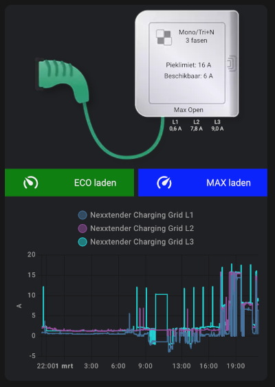
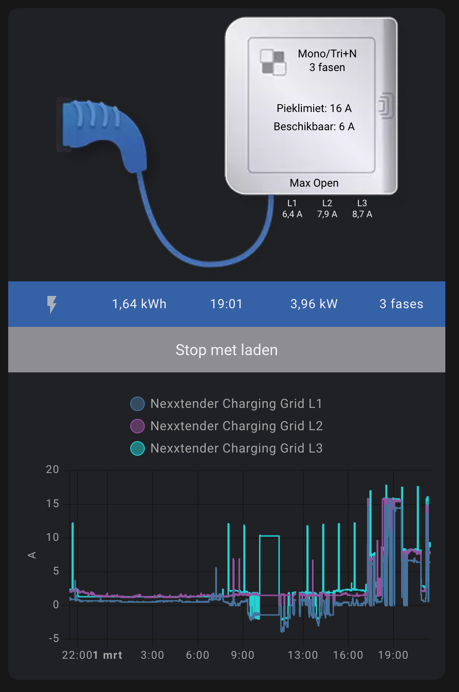

### Change charger config

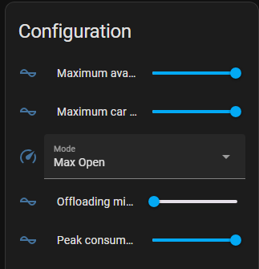

### Controls

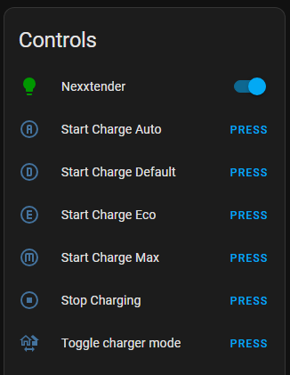

### Sensors

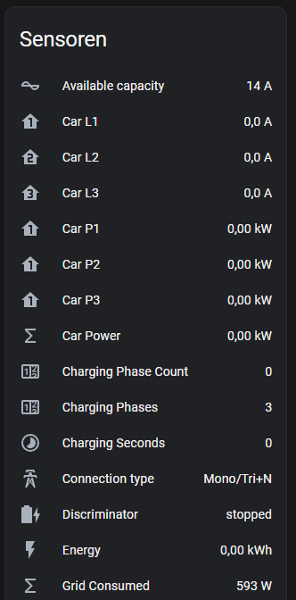
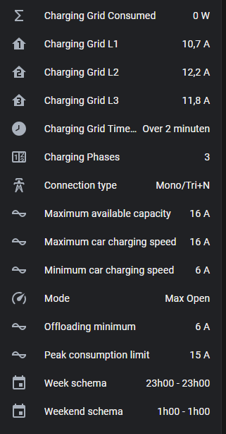

### Diagnostics

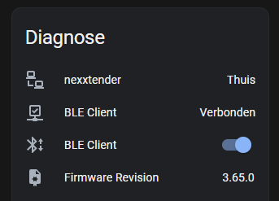

## Entities

| Name                                   | Entity ID                                                | Entity Type   | Description                                                                                                                                              |
| -------------------------------------- | -------------------------------------------------------- | ------------- | -------------------------------------------------------------------------------------------------------------------------------------------------------- |
| Maximum available capacity             | number.nexxtender_maximum_available_capacity             | Configuration | Maximum allowed grid consumption limit in A. Set this to a lower value if you have a peak tariff contract                                                |
| Maximum car charging speed             | number.nexxtender_maximum_car_charging_speed             | Configuration | Maximum allowed charging speed in A for the car                                                                                                          |
| Mode                                   | select.nexxtender_mode                                   | Configuration | Private limits to whitelisted badges only. Open is without restriction. Modes: Eco Private, Max Private, Eco Open, Max Open                              |
| Offloading minimum                     | number.nexxtender_offloading_minimum                     | Configuration | Minimum charging speed in A for the charger. Certified chargers are required to provide a minimum of 6A                                                  |
| Peak consumption limit                 | number.nexxtender_peak_consumption_limit                 | Configuration | Peak grid consumption limit                                                                                                                              |
| Nexxtender                             | light.nexxtender_nexxtender                              | Controls      | LED light on the ESP32 S3 board                                                                                                                          |
| Start Charge Auto                      | button.nexxtender_start_charge_auto                      | Controls      | Start charging in Auto mode                                                                                                                              |
| Start Charge Default                   | button.nexxtender_start_charge_default                   | Controls      | Start charging in Default mode                                                                                                                           |
| Start Charge Eco                       | button.nexxtender_start_charge_eco                       | Controls      | Start charging in ECO mode                                                                                                                               |
| Start Charge Max                       | button.nexxtender_start_charge_max                       | Controls      | Start charging in MAX mode                                                                                                                               |
| Stop Charging                          | button.nexxtender_stop_charging                          | Controls      | Stop charging                                                                                                                                            |
| Toggle charger mode                    | button.nexxtender_toggle_charger_mode                    | Controls      | Toggle charging mode between ECO and MAX                                                                                                                 |
| BLE Client                             | binary_sensor.nexxtender_ble_client                      | Diagnostic    | Indicates the connection state of the BLE client with the Nexxtender charger                                                                             |
| BLE Client                             | switch.nexxtender_ble_client                             | Diagnostic    | Switch to (dis)connect the BLE client with the Nexxtender charger                                                                                        |
| Code version                           | sensor.nexxtender_code_version                           | Diagnostic    | Shows the version of the esphome nexxtender code you are running (this github code)                                                                      |
| Firmware Revision                      | sensor.nexxtender_firmware_revision                      | Diagnostic    | Shows the installed firmware on the integrated ESP of your nexxtender charger                                                                            |
| Generic Status                         | sensor.nexxtender_generic_status                         | Diagnostic    | Shows the last generic BLE command                                                                                                                       |
| Grid Interval                          | sensor.nexxtender_grid_interval                          | Diagnostic    | Grid Interval is a counter that goes from 0->900 (15 minutes)                                                                                            |
| Hardware Revision                      | sensor.nexxtender_hardware_revision                      | Diagnostic    | Hexadecimal hardware revision or Model Number                                                                                                            |
| Model Number                           | sensor.nexxtender_model_number                           | Diagnostic    | Decimal model number                                                                                                                                     |
| Read time                              | button.nexxtender_read_time                              | Diagnostic    | Updates the Nexxtender Time sensor with the charger time value                                                                                           |
| Restart Nexxtender ESP                 | button.nexxtender_restart_nexxtender_esp                 | Diagnostic    | Restart the Nexxtender ESP board                                                                                                                         |
| Serial Number                          | sensor.nexxtender_serial_number                          | Diagnostic    | The serial number                                                                                                                                        |
| Sync time                              | button.nexxtender_sync_time                              | Diagnostic    | Synchronises the ESP time. It pushes the HA time to the Nexxtender charger                                                                               |
| Time                                   | sensor.nexxtender_nexxtender_time                        | Diagnostic    | Current time reported by the Nexxtender charger                                                                                                          |
| Available capacity                     | sensor.nexxtender_available_capacity                     | Sensors       | Available capacity in A                                                                                                                                  |
| Car Current                            | sensor.nexxtender_car_current                            | Sensors       | Sum of Car L1, L2 and L3                                                                                                                                 |
| Car L1                                 | sensor.nexxtender_car_l1                                 | Sensors       | Car phase L1 current in A                                                                                                                                |
| Car L2                                 | sensor.nexxtender_car_l2                                 | Sensors       | Car phase L2 current in A                                                                                                                                |
| Car L3                                 | sensor.nexxtender_car_l3                                 | Sensors       | Car phase L3 current in A                                                                                                                                |
| Car P1                                 | sensor.nexxtender_car_p1                                 | Sensors       | Car phase L1 power consumption in kW                                                                                                                     |
| Car P2                                 | sensor.nexxtender_car_p2                                 | Sensors       | Car phase L2 power consumption in kW                                                                                                                     |
| Car P3                                 | sensor.nexxtender_car_p3                                 | Sensors       | Car phase L3 power consumption in kW                                                                                                                     |
| Car Power                              | sensor.nexxtender_car_power                              | Sensors       | Total power consumption from the car in kW                                                                                                               |
| Car Power Mode                         | sensor.nexxtender_car_power_mode                         | Sensors       | Power mode of the car. Can be Eco, Max or not charging. The eco threshold is calculated on the number of phases. This mode is derived from the Car Power |
| Car Timestamp                          | sensor.nexxtender_car_timestamp                          | Sensors       | Current time in UTC Unix Time                                                                                                                            |
| Charging Advanced Grid Energy          | sensor.nexxtender_charging_advanced_grid_energy          | Sensors       | Energy calculation based on the grid power                                                                                                               |
| Charging Advanced Grid Energy Consumed | sensor.nexxtender_charging_advanced_grid_energy_consumed | Sensors       | Consumed energy based on grid power — use in HA Energy dashboard: Grid consumption                                                                       |
| Charging Advanced Grid Energy Produced | sensor.nexxtender_charging_advanced_grid_energy_produced | Sensors       | Produced (exported) energy based on grid power — use in HA Energy dashboard: Return to grid                                                              |
| Charging Advanced Timestamp            | sensor.nexxtender_charging_advanced_timestamp            | Sensors       | Current time in UTC Unix Time                                                                                                                            |
| Charging Phase Count                   | sensor.nexxtender_charging_phase_count                   | Sensors       | Number of active phases during charging session                                                                                                          |
| Charging Phases                        | sensor.nexxtender_charging_phases                        | Sensors       | Number of available phases                                                                                                                               |
| Charging Seconds                       | sensor.nexxtender_charging_seconds                       | Sensors       | Number of seconds in the active charging session                                                                                                         |
| Connection type                        | sensor.nexxtender_connection_type                        | Sensors       | Connection type. Mono/Tri+N: Single-phase or Three-phase with neutral, Tri: Three-phase without neutral                                                  |
| Discriminator                          | sensor.nexxtender_discriminator                          | Sensors       | Discriminator state (plugged, charging, fault, unplugged)                                                                                                |
| Energy                                 | sensor.nexxtender_energy                                 | Sensors       | Consumed energy during a charging session                                                                                                                |
| Grid Consumed                          | sensor.nexxtender_grid_consumed                          | Sensors       | Grid consumption, sum of grid L1+L2+L3, expressed in W                                                                                                   |
| Grid L1                                | sensor.nexxtender_grid_l1                                | Sensors       | Grid phase L1 current in A                                                                                                                               |
| Grid L2                                | sensor.nexxtender_grid_l2                                | Sensors       | Grid phase L2 current in A                                                                                                                               |
| Grid L3                                | sensor.nexxtender_grid_l3                                | Sensors       | Grid phase L3 current in A                                                                                                                               |
| Grid Power                             | sensor.nexxtender_grid_power                             | Sensors       | Total power consumption from the grid in W                                                                                                               |
| Grid Timestamp                         | sensor.nexxtender_grid_timestamp                         | Sensors       | Current time in UTC Unix Time                                                                                                                            |
| Maximum available capacity             | sensor.nexxtender_maximum_available_capacity             | Sensors       | Maximum allowed grid consumption limit in A. You can set this with the `number.nexxtender_maximum_available_capacity`                                    |
| Maximum car charging speed             | sensor.nexxtender_maximum_car_charging_speed             | Sensors       | Maximum allowed charging speed in A for the car. You can set this with the `number.nexxtender_maximum_car_charging_speed`                                |
| Minimum car charging speed             | sensor.nexxtender_minimum_car_charging_speed             | Sensors       | Minimum car charging speed                                                                                                                               |
| Mode                                   | sensor.nexxtender_mode                                   | Sensors       | Current charging mode                                                                                                                                    |
| Offloading minimum                     | sensor.nexxtender_offloading_minimum                     | Sensors       | Minimum charging speed in A for the device. Certified chargers are required to provide a minimum of 6A                                                   |
| Peak consumption limit                 | sensor.nexxtender_peak_consumption_limit                 | Sensors       | Peak grid consumption limit                                                                                                                              |
| Status                                 | sensor.nexxtender_status                                 | Sensors       | Status of the charger (Plugged, Charging, Fault, Unplugged)                                                                                              |
| Week schema                            | sensor.nexxtender_week_schema                            | Sensors       | Off peak charging schema during the week                                                                                                                 |
| Weekend schema                         | sensor.nexxtender_weekend_schema                         | Sensors       | Off peak charging schema during the weekend                                                                                                              |

## Table of contents

<!-- TOC -->

- [ESPHome BLE Client for Powerdale Nexxtender EV Charger](#esphome-ble-client-for-powerdale-nexxtender-ev-charger)
  - [Features](#features)
  - [Screenshots](#screenshots)
    - [Lovelace card](#lovelace-card)
    - [Change charger config](#change-charger-config)
    - [Controls](#controls)
    - [Sensors](#sensors)
    - [Diagnostics](#diagnostics)
  - [Entities](#entities)
  - [Table of contents](#table-of-contents)
  - [Getting Started](#getting-started)
    - [Finding Nexxtender Bluetooth MAC Address with NRF Connect App](#finding-nexxtender-bluetooth-mac-address-with-nrf-connect-app)
    - [Finding Nexxtender Bluetooth passkey](#finding-nexxtender-bluetooth-passkey)
    - [Installing & Configuring ESPHome](#installing--configuring-esphome)
      - [a. Create a New ESPHome Configuration](#a-create-a-new-esphome-configuration)
      - [b. Choosing the Correct Configuration File](#b-choosing-the-correct-configuration-file)
      - [c. Configuration Notes](#c-configuration-notes)
    - [Integrating your esp32 in Home Assistant](#integrating-your-esp32-in-home-assistant)
      - [Customizing ESP32 Configuration Optional](#customizing-esp32-configuration-optional)
        - [ESP32-S3-N16R8](#esp32-s3-n16r8)
  - [Activating the Integrated ESPHome Webserver/GUI](#activating-the-integrated-esphome-webservergui)
  - [Integrating ESPHome Devices with Home Assistant](#integrating-esphome-devices-with-home-assistant)
  - [HTTP API Integration Optional](#http-api-integration-optional)
    - [Configuration](#configuration)
    - [POST Events & Endpoints](#post-events--endpoints)
    - [Example Requests](#example-requests)
      - [POST http://your-api-server.com/charger/status](#post-httpyour-api-servercomchargerstatus)
      - [POST http://your-api-server.com/charger/event](#post-httpyour-api-servercomchargerevent)
      - [POST http://your-api-server.com/charger/session/minimal](#post-httpyour-api-servercomchargersessionminimal)
    - [Notes](#notes)
  - [MQTT Integration Optional](#mqtt-integration-optional)
    - [Enabling MQTT](#enabling-mqtt)
    - [MQTT Topics Published](#mqtt-topics-published)
    - [Why MQTT?](#why-mqtt)
  - [Entity Naming Convention for Homey & Other Integrations](#entity-naming-convention-for-homey--other-integrations)
    - [Example](#example)
    - [How It Works](#how-it-works)
  - [Contributing](#contributing)
  - [License](#license)
  - [Support](#support)

<!-- /TOC -->

## Getting Started

To integrate the ESPHome BLE client with your Powerdale Nexxtender EV Charger and Home Assistant, follow these steps:

### Finding Nexxtender Bluetooth MAC Address with NRF Connect App

Before integrating your Nexxtender EV Charger with the ESPHome BLE client, you'll need to find its Bluetooth MAC address. You can do this using the NRF Connect app, available for both Android and iOS devices. Follow these steps:

1. **Download and Install NRF Connect**: Go to the Google Play Store (for Android) or the Apple App Store (for iOS) and search for "NRF Connect." Download and install the app on your mobile device.

2. **Open NRF Connect**: Launch the NRF Connect app on your mobile device.

3. **Scan for BLE Devices**: In the NRF Connect app, navigate to the "Scanner" tab and start scanning for nearby Bluetooth devices.

4. **Locate Nexxtender EV Charger ("HOME")**: The charger's Bluetooth module should broadcast its presence with the name "HOME," allowing NRF Connect to detect it.

5. **View Device Details**: Once NRF Connect detects the Nexxtender EV Charger, tap on it to view its details. Among the information displayed, you'll find the Bluetooth MAC address (also known as the BD_ADDR) of the charger.

6. **Note MAC Address**: Make a note of the Bluetooth MAC address of your Nexxtender EV Charger. You'll need this MAC address when configuring the ESPHome BLE client.

By following these steps, you can easily find the Bluetooth MAC address of your Nexxtender EV Charger named "HOME" using the NRF Connect app.

If you don't have the possibility to use the NRF Connect App, you can try scanning for bluetooth devices in your Chrome browser

```text
chrome://bluetooth-internals/#devices
```

### Finding Nexxtender Bluetooth passkey

The Nexxtender passkey is the PIN code that is used to pair your BLE device with the charger. (6 digit number)
If you don't have the PIN code (or you have lost it), you can always reach out to me and I can calculate it if you provide me the serial number of the box (format XXXXX-XX-XXXX-XXXXX-XX).
The serial number can be found on the sticker, located at the bottom of the Nexxtender device.
The PN and the SN numbers are the numbers needed to calculate the PIN code.
PN: XXXXX-XX
SN: XXXX-XXXXX-XX

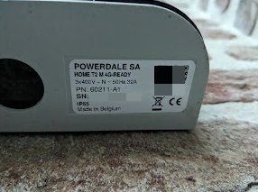

### Installing & Configuring ESPHome

1. **Install ESPHome:** If you haven't already, install ESPHome by following the [instructions here](https://esphome.io/guides/getting_started_command_line.html#installation-step) or [here in combination with HA](https://esphome.io/guides/getting_started_hassio.html).

   Make sure you install at least the ESPhome version 2024.2.0. The latest version is always recommended.

   You then need to create a new YAML configuration for you nexxtender charger, compile it (this will create the corresponding C++ code and resulting binary), and upload it to your esp32.

   There are several ways to do this, for example using command line or your favorite IDE, or directly via the ESPHome dashboard add-on proposed by Home Assistant.

2. **Create a new ESPHome Configuration:** Create a new file named `nexxtender.yaml` in your local directory.

   #### **a. Create a New ESPHome Configuration**

   If you followed the proposed HomeAssistant ESPHome wizard, you already ended up with a yaml file. If needed, first rename this file in `nexxtender.yaml` using the `Rename hostname` option. Note that this will also trigger the compilation and can take some time. Alternatively, delete the configuration created by the wizard and create a new one.

   Edit and copy/paste the content of the provided `nexxtender.yaml` into or at the end of this file (or copy/paste the below yaml).

   ```yaml
   packages:
     nexxtender:
       url: https://github.com/geertmeersman/nexxtender
       files: [
           config/ha_addon.yaml, # how you run esphome: ha_addon, docker, local (see 2.b)
           config/s3.yaml, # if you have an ESP32 S3 board (optional line)
           config/mqtt/false.yaml, # mqtt config: true.yaml or false.yaml
           config/wifi.yaml, # only include if you need wifi. In case of ethernet, add the component manually
         ]
       refresh: 0s
   substitutions:
     ## Uncomment and modify when you want to use a different device name.
     # device_name: nexxtender
     # friendly_name: Nexxtender
     ## Uncomment and modify when you want to use a different threshold.
     # charging_mode_eco_threshold: "8"      # Single phase (6A + 2 margin)
     # charging_mode_eco_bi_threshold: "14"  # Bi-phase (12A + 2 margin)
     # charging_mode_eco_tri_threshold: "20" # Tri-phase (18A + 2 margin)
     # slider_max_car_charging_speed: "32"     # The max value of the slider for the maximum car charging speed slider, default set to 32
     # slider_max_available_capacity: "40"     # The max value of the slider for the maximum available capacity slider, default set to 40
     # slider_max_peak_consumption_limit: "40" # The peak consumption limit for the slider (in amperes, typically 16-40A). WARNING: Incorrect values may cause circuit breaker trips or reduced charging performance. This value is usually configured by your installer.
     # min_charging_value: "6" # The minimal charging value, used for the slider configs
     # slider_max_offloading_minimum: "32" # The max offloading minimum value
     # slider_min_offloading_minimum: "6" # The min offloading minimum value
   ```

   #### **b. Choosing the Correct Configuration File**

   Depending on how you run ESPHome, use the appropriate configuration file:

   - **`config/ha_addon.yaml`** → For ESPHome running as a **Home Assistant Add-on**
   - **`config/docker.yaml`** → For ESPHome running in a **standalone Docker container**
   - **`config/local.yaml`** → For local compilation when working in a **git clone**

   If you are running on an ESP32 S3 board:

   - **`config/s3.yaml`** → Include this file when you use an ESP32 S3 board

   If you intend to publish to an MQTT broker:

   - **`config/mqtt/true.yaml`** → if you wish to publish to MQTT
   - **`config/mqtt/false.yaml`** → if you don't use MQTT

   If you connect to WiFi:

   - **`config/wifi.yaml`** → include if you will be connecting through WiFi
   - if you have a board with ethernet, add the [ethernet component config](https://esphome.io/components/ethernet/) to your configuration

   #### **c. Configuration Notes**

   - The charging power mode is estimated based on the number of phases used during the charge.
   - The substitution `charging_mode_eco_threshold` and the others are optional, and you can set it to whatever Amp you want to be used as a threshold for the ECO/MAX sensor. Default values are the ones set in the example.
     Attention, it does not influence your charger; it is just a way of indicating which speed the charger is delivering.
   - The substitution `slider_max_car_charging_speed` lets you override the maximum value for the configuration slider of the maximum car charging speed. This is usually set to the value of the circuit breaker A. Default value is the ones set in the example.
   - The substitution `slider_max_available_capacity` lets you override the maximum value for the configuration slider of the maximum available capacity of the grid. This is usually set to the value of the circuit breaker A. Default value is the ones set in the example.
   - The subsitution `slider_max_peak_consumption_limit` lets you override the maximum value for configuration slider of the maximum peak consumption value.
   - The substitution `min_charging_value` defines the minimal value of the sliders, or the minimal A value for the car

3. **Update the secrets.yaml:**

   Ensure that your `secrets.yaml` file contains the following entries:

   ```yaml
   esphome_admin_password: "YOUR_ESPHOME_ADMIN_PASSWORD"
   wifi_ssid: "YOUR_WIFI_SSID"
   wifi_password: "YOUR_WIFI_PASSWORD"
   esphome_api_key: "YOUR_ESPHOME_API_KEY"
   nexxtender_mac: "YOUR_NEXXTENDER_MAC_ADDRESS"
   nexxtender_passkey: "YOUR_NEXXTENDER_PASSKEY"
   ```

   In the HomeAssistant ESPHome dashboard, this is done using the top righ shortcut `SECRETS`.

   Replace `"YOUR_ESPHOME_ADMIN_PASSWORD"`, `"YOUR_WIFI_SSID"`, `"YOUR_WIFI_PASSWORD"`, `"YOUR_ESPHOME_API_KEY"`, `"YOUR_NEXXTENDER_MAC_ADDRESS"`, and `"YOUR_NEXXTENDER_PASSKEY"` with your actual values.

   The `nexxtender_mac` is the bluetooth mac address you found in the previous step.

   The `nexxtender_passkey` is the PIN code you use to pair your Nexxtender. Explanations on how to find it can be [found here](#finding-nexxtender-bluetooth-passkey).

   The `esphome_admin_password` is the password that is used for the Wi-Fi fallback hotspot and OTA.

   If you don't know how to define the `esphome_api_key`, you can obtain one as [described here](https://esphome.io/components/api.html) in the section Configuration variables > encryption > key.

4. **Compile Firmware:** Compile the ESPHome firmware using the `nexxtender.yaml` configuration file. Run the following command in your terminal, pointing to the location of your `nexxtender.yaml` file:

   ```bash
   esphome compile nexxtender.yaml
   ```

   Using the Home Assistant ESPHome dashboard, the firmware compilation, upload and flashing of your esp32 is done in one step by using the `Install` option.
   Optionally, you can first run the `Validate` command that will check all the code and links before compiling it. Considering the compilation can take some time, this is a recommended step.

5. **Flash Firmware:** Flash the compiled firmware to your ESPHome device using the following command:

   ```bash
   esphome upload nexxtender.yaml
   ```

   This step is thus normally already done when using the HomeAssistant ESPHome dashboard.

   Note: If you’re just seeing Connecting....\_\_\_\_.... on the screen and the flashing fails, please double-check the UART wires are connected correctly if flashing using a USB to UART bridge.

   For some devices you need to keep pressing the BOOT button until flashing has begun (i.e. Geekcreit DOIT ESP32 DEVKIT V1).

   [Consult the FAQ part on esphome.io](https://esphome.io/guides/faq.html).

### Integrating your esp32 in Home Assistant

1. **Integrate with Home Assistant:** In your Home Assistant configuration, add the ESPHome device as a new integration. Follow the instructions provided by Home Assistant to discover and integrate the Nexxtender charger with your Home Assistant setup.

2. **Monitor Logs:** Monitor the ESPHome device logs to ensure that the BLE client establishes a connection with the Powerdale Nexxtender EV Charger successfully.

3. **Test Functionality:** Test the functionality of the ESPHome BLE client by monitoring real-time data from the Nexxtender charger and controlling its operation remotely from your ESPHome device or through the Home Assistant interface.

#### Customizing ESP32 Configuration (Optional)

The standard configuration utilises the `az-delivery-devkit-v4` board. If you would have another ESP32 board, feel free to customize it.

If you want to customize the ESP32 section in your `nexxtender.yaml` file for your specific board type, you can add the following section at the end of the nexxtender.yaml:

```yaml
esp32:
  board: YOUR_ESP32_BOARD_TYPE
```

Replace `YOUR_ESP32_BOARD_TYPE` with the specific board type you're using, such as `az-delivery-devkit-v4` or any other compatible board.

##### ESP32-S3-N16R8

Example for the ESP32-S3-N16R8, buy here: [Aliexpress](https://a.aliexpress.com/_EwvIgjF). Make sure you pick the right type (they call it color): 'ESP32-S3-N16R8'.

```yaml
esp32:
  board: esp32-s3-devkitc-1

esphome:
  platformio_options:
    board_build.flash_mode: dio
```

For this specific board, I have created a specific yaml that manages the RGB LED that is integrated on the board.

The complete configuration file would look like:

```yaml
packages:
  nexxtender:
    url: https://github.com/geertmeersman/nexxtender
    files: [
        config/ha_addon.yaml, # how you run esphome: ha_addon, docker, local,
        config/s3.yaml, # if you have an ESP32 S3 board (optional line)
        config/mqtt/false.yaml, # mqtt config: true.yaml or false.yaml
        config/wifi.yaml, # only include if you need wifi. In case of ethernet, add the component manually
      ]
    refresh: 0s
substitutions:
  device_name: nexxtender
  friendly_name: Nexxtender
```

This flexibility allows users to tailor the configuration to their hardware requirements while still benefiting from the overall structure and functionality provided in the `nexxtender.yaml` file.

## Activating the Integrated ESPHome Webserver/GUI

The Nexxtender comes equipped with an integrated ESPHome webserver and graphical user interface (GUI) to provide an intuitive way to manage and configure your device if you don't plan to use [Home Assistant](https://www.home-assistant.io). Follow the steps below to activate and access this feature:

1. **Activate the webserver package:**

   There is a webserver configuration that you can activate by using the yaml below.

   ```yaml
   packages:
     nexxtender:
       url: https://github.com/geertmeersman/nexxtender
       files: [
           config/ha_addon.yaml, # how you run esphome: ha_addon, docker, local,
           config/s3.yaml, # if you have an ESP32 S3 board (optional line)
           config/mqtt/false.yaml, # mqtt config: true.yaml or false.yaml
           config/wifi.yaml, # only include if you need wifi. In case of ethernet, add the component manually
           config/webserver.yaml, # If you want to enable the esphome webserver
         ]
       refresh: 0s
   ```

   The content of the included webserver.yaml configuration file is the following:

   ```yaml
   web_server:
     auth:
       username: admin
       password: !secret esphome_admin_password
   ```

   If you don't need authentication, you can just add this to your nexxtender.yaml configuration:

   ```yaml
   web_server:
   ```

   It will then activate the webserver on the standard port and without authentication.

2. **Access the Web Interface:** Open a web browser on a device connected to the same network as your Nexxtender.

3. **Enter the IP Address/mDNS:** In the address bar of your web browser, enter the IP address assigned to your Nexxtender. You can usually find this information in your router's administration interface or by using a network scanning tool. You could also use the mDNS [http://nexxtender.local](http://nexxtender.local)

4. **Login:** If prompted, enter any necessary login credentials to access the ESPHome webserver.

5. **Explore and Configure:** Once logged in, you'll have access to the ESPHome GUI, where you can explore various settings, configure parameters, and monitor the status of your Nexxtender.

6. **Save Changes:** Remember to save any changes you make within the ESPHome interface to ensure they are applied to your Nexxtender.

More details can be found here: [https://esphome.io/components/web_server.html](https://esphome.io/components/web_server.html)

## Integrating ESPHome Devices with Home Assistant

To integrate ESPHome devices with Home Assistant, follow these steps:

1. **Prerequisites**: Ensure you have the ESPHome integration enabled in Home Assistant. You can do this by navigating to Configuration -> Integrations, clicking the "+" button to add an integration, searching for "ESPHome," and following the instructions to set it up.

2. **Discover ESPHome Devices**: After enabling the integration, Home Assistant will automatically discover ESPHome devices on your network. If your devices don't show up automatically, you can add them manually by providing their IP address and API key.

3. **Configuration YAML**: You can also configure ESPHome devices manually by adding them to your Home Assistant configuration YAML file. This allows for more advanced configuration options and customization.

4. **View Devices**: Once your ESPHome devices are discovered or added manually, you can view and manage them in the Home Assistant UI. This includes monitoring their status, viewing sensor data, and controlling their actions.

5. **Integrate with Automations**: You can use ESPHome devices in your Home Assistant automations to trigger actions based on sensor readings, device status changes, or other events.

6. **Integrate in the energy dashboard**: You can integrate the produced and consumed energy in the energy dashboard.

   [](https://my.home-assistant.io/redirect/config_energy/)

   Select:

   - Grid consumption: sensor.nexxtender_charging_advanced_grid_energy_consumed
   - Return to grid: sensor.nexxtender_charging_advanced_grid_energy_produced

   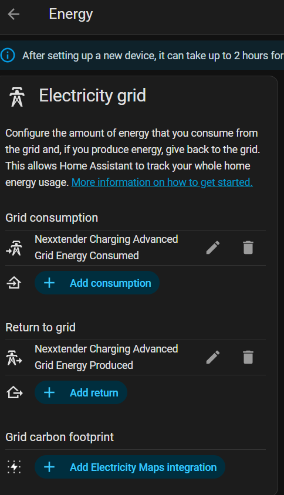

7. **Customization**: Home Assistant allows for extensive customization of ESPHome devices, including renaming, grouping, and organizing them to fit your home automation setup.

8. **Updates and Maintenance**: Keep your ESPHome devices up to date by regularly checking for firmware updates and configuring automatic OTA updates if desired.

9. **Blueprint for zone automation**:
   Automate the switching of Nexxtender mode based on car entry or exit from a specified zone.

   This blueprint allows you to configure the device tracker for your car, the Nexxtender mode sensor, the mode selector, the zone where the Nexxtender is located, the desired Nexxtender mode, and the trigger event for zone entry or exit.

   [](https://my.home-assistant.io/redirect/blueprint_import/?blueprint_url=https%3A%2F%2Fgithub.com%2Fgeertmeersman%2Fnexxtender%2Fblob%2Fmain%2Fblueprints%2Fnexxtender_car_zone.yaml)

   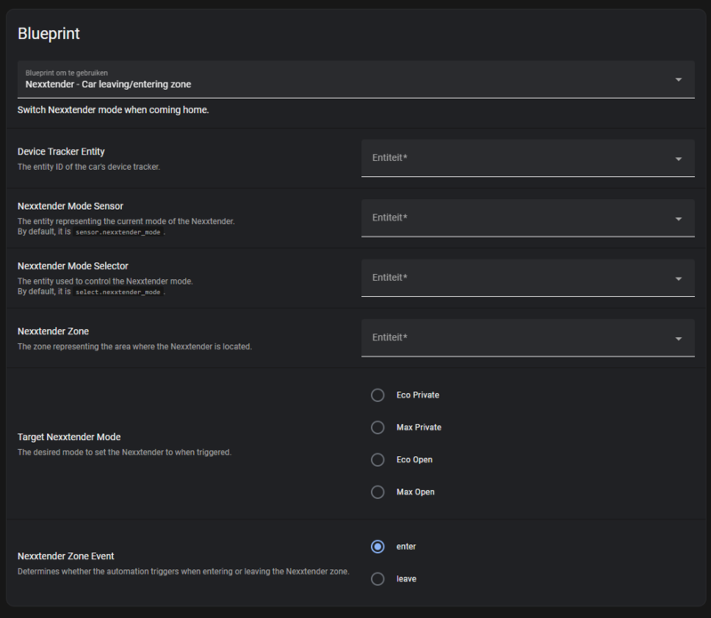

10. **Blueprint for Charging Notifications**:
    Receive instant notifications when your car starts or stops charging based on the Nexxtender discriminator sensor.

    This blueprint allows you to configure the **Nexxtender discriminator sensor**, select a **mobile device** for notifications, and customize the **notification titles and messages** for both charging start and stop events.

    Whenever the Nexxtender sensor detects a change from **"Stopped" → "Started"**, you will receive a notification that charging has begun. Similarly, when the sensor changes from **"Charging" → "Stopped"**, you will be alerted that charging has ended.

    With this blueprint, you can stay informed about your car's charging status in real-time, ensuring you never miss an important update. 🚗⚡

    [](https://my.home-assistant.io/redirect/blueprint_import/?blueprint_url=https%3A%2F%2Fgithub.com%2Fgeertmeersman%2Fnexxtender%2Fblob%2Fmain%2Fblueprints%2Fnexxtender_car_charging_notifications.yaml)

    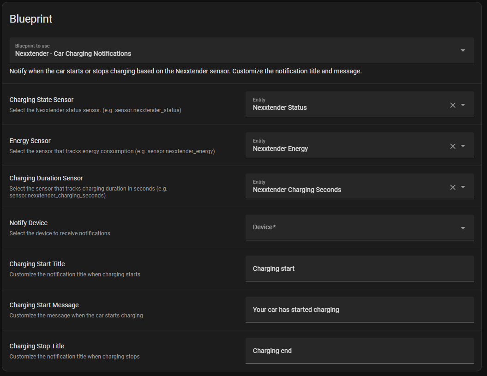

11. **Lovelace dashboard card**:


   <details><summary>Show markdown code</summary>

The example uses the following custom lovelace cards:

- [button-card](https://github.com/custom-cards/button-card)
- [card-mod](https://github.com/thomasloven/lovelace-card-mod)
- [vertical-stack-in-card](https://github.com/ofekashery/vertical-stack-in-card)

The images used are available in the images folder of this repository.

In the example below they are located in your HA /config/www/images/auto/ folder.

```yaml
type: custom:vertical-stack-in-card
cards:
  - type: picture-elements
    aspect_ratio: 2
    elements:
      - style:
          top: 50px
          left: 73%
        show_name: false
        show_icon: false
        type: custom:button-card
        entity: sensor.nexxtender_connection_type
        show_state: true
        styles:
          card:
            - background: none
            - border-radius: 0
            - border: 0
            - font-size: 12px
            - color: black
      - style:
          top: 65px
          left: 73%
        show_name: true
        name: |
          [[[ return entity.state+" fasen"; ]]]
        show_icon: false
        type: custom:button-card
        entity: sensor.nexxtender_charging_phases
        show_state: false
        styles:
          card:
            - background: none
            - border-radius: 0
            - border: 0
            - font-size: 12px
            - color: black
      - style:
          top: 110px
          left: 70%
        show_name: true
        name: Pieklimiet
        layout: name_state
        show_icon: false
        type: custom:button-card
        entity: sensor.nexxtender_peak_consumption_limit
        show_state: true
        styles:
          card:
            - background: none
            - border-radius: 0
            - border: 0
            - font-size: 12px
            - color: black
      - style:
          top: 130px
          left: 70%
        show_name: true
        name: Beschikbaar
        layout: name_state
        show_icon: false
        type: custom:button-card
        entity: sensor.nexxtender_available_capacity
        show_state: true
        styles:
          card:
            - background: none
            - border-radius: 0
            - border: 0
            - font-size: 12px
            - color: black
      - style:
          top: 192px
          left: 70%
        show_name: false
        show_icon: false
        type: custom:button-card
        entity: sensor.nexxtender_mode
        show_state: true
        styles:
          card:
            - background: none
            - border-radius: 0
            - border: 0
            - font-size: 12px
            - color: black
      - name: L1
        style:
          top: 220px
          left: 65%
        show_name: true
        show_icon: false
        type: custom:button-card
        entity: sensor.nexxtender_grid_l1
        show_state: true
        styles:
          card:
            - background: none
            - border-radius: 0
            - border: 0
            - font-size: 10px
      - name: L2
        style:
          top: 220px
          left: 73%
        show_name: true
        show_icon: false
        type: custom:button-card
        entity: sensor.nexxtender_grid_l2
        show_state: true
        styles:
          card:
            - background: none
            - border-radius: 0
            - border: 0
            - font-size: 10px
      - name: L3
        style:
          top: 220px
          left: 81%
        show_name: true
        show_icon: false
        type: custom:button-card
        entity: sensor.nexxtender_grid_l3
        show_state: true
        styles:
          card:
            - background: none
            - border-radius: 0
            - border: 0
            - font-size: 10px
    image: /local/images/1x1.png
    card_mod:
      style: |
        ha-card {
          
          
            
          
            
          
            
          
            
          
          background-size: 100% 100%;
          background-image: url(/local/images/auto/device_home_{{image}}.png);
          height: 300px !important;
          border-radius: 0;
          margin: 0;
        }
  - type: conditional
    conditions:
      - condition: numeric_state
        entity: sensor.nexxtender_charging_phase_count
        above: 0
    card:
      type: picture-elements
      elements:
        - type: state-icon
          entity: sensor.nexxtender_energy
          style:
            top: 25px
            left: 10%
        - type: state-label
          entity: sensor.nexxtender_energy
          style:
            top: 25px
            left: 30%
        - type: state-label
          entity: sensor.nexxtender_charging_seconds
          style:
            top: 25px
            left: 50%
        - type: state-label
          entity: sensor.nexxtender_car_power
          style:
            top: 25px
            left: 70%
        - type: state-label
          entity: sensor.nexxtender_charging_phase_count
          suffix: " fases"
          style:
            top: 25px
            left: 90%
      image: /local/images/1x1.png
      card_mod:
        style: |
          ha-card {
            height: 50px !important;
            background-color: #325FA8;
          }
  - type: conditional
    conditions:
      - condition: state
        entity: sensor.nexxtender_status
        state: Plugged
    card:
      type: horizontal-stack
      cards:
        - show_name: true
          show_icon: true
          icon: mdi:speedometer-slow
          type: custom:button-card
          layout: icon_name
          tap_action:
            action: toggle
          entity: button.nexxtender_start_charge_eco
          name: ECO laden
          styles:
            card:
              - background: green
              - border-radius: 0
              - height: 50px
        - show_name: true
          show_icon: true
          icon: mdi:speedometer
          type: custom:button-card
          layout: icon_name
          tap_action:
            action: toggle
          entity: button.nexxtender_start_charge_max
          name: MAX laden
          styles:
            card:
              - background: blue
              - border-radius: 0
              - height: 50px
  - type: conditional
    conditions:
      - condition: state
        entity: sensor.nexxtender_status
        state: Charging
    card:
      show_name: true
      show_icon: false
      type: custom:button-card
      icon: mdi:stop
      tap_action:
        action: toggle
      entity: button.nexxtender_stop_charging
      name: Stop met laden
      styles:
        card:
          - background: "#8E8D92"
          - border-radius: 0
          - height: 50px
  - type: conditional
    conditions:
      - condition: state
        entity: sensor.nexxtender_status
        state: Unplugged
    card:
      type: markdown
      content: <center>Sluit de kabel aan om te kunnen starten met laden</center>
  - type: history-graph
    entities:
      - entity: sensor.nexxtender_grid_l1
      - entity: sensor.nexxtender_grid_l2
      - entity: sensor.nexxtender_grid_l3
    logarithmic_scale: false
```

   </details>

## HTTP API Integration (Optional)

This ESPHome configuration supports sending HTTP POST requests to an external server to track real-time charger state, charging sessions, and key events. This feature allows seamless backend integrations with third-party platforms or logging systems.

### Configuration

To activate HTTP POST support, set the following substitutions in your ESPHome YAML (attention to the escaping of the "):

```yaml
substitutions:
  http_post_enabled: "true"
  http_base_url: '"http://your-api-server.com"' # Replace with your backend API, beware of the escaping
  http_x_api_key: '"your-api-key"' # Replace with your authentication key and for security reasons store it in your secrets
```

These values are passed to ESPHome globals and used in the request headers and URL.

### POST Events & Endpoints

| Trigger Condition                           | Script                  | Endpoint                   | Description                                              |
| ------------------------------------------- | ----------------------- | -------------------------- | -------------------------------------------------------- |
| Every 60 seconds (while charging)           | `send_charging_status`  | `/charger/status`          | Regular status update with session metrics               |
| On status change (e.g., Plugged → Charging) | `send_charger_event`    | `/charger/event`           | Sends event name (e.g., "Charging", "Unplugged")         |
| On Unplugged **and** energy > 0             | `send_charging_session` | `/charger/session/minimal` | Sends session summary when unplugged with energy present |

> These scripts use the ESPHome `http_request.post` action with custom JSON payloads.

### Example Requests

#### `POST http://your-api-server.com/charger/status`

```json
{
  "charger_id": "Nexxtender",
  "seconds": 530,
  "energy": 3.2,
  "status": "Charging",
  "phase_count": 3
}
```

#### `POST http://your-api-server.com/charger/event`

```json
{
  "event_type": "Unplugged",
  "charger_id": "Nexxtender"
}
```

#### `POST http://your-api-server.com/charger/session/minimal`

```json
{
  "charger_id": "Nexxtender",
  "seconds": 530,
  "energy": 3.2
}
```

### Notes

- The `charger_id` is passed via the `${friendly_name}` substitution and is hardcoded per ESP device.
- HTTP requests include an `x-api-key` header for basic authentication. Make sure to store it in your secrets.
- All communication is controlled by the `g_http_post_enabled` global boolean.

## MQTT Integration (Optional)

In addition to HTTP POSTs, this configuration supports publishing charging data to MQTT topics. This allows real-time session and status data to be consumed by systems like Home Assistant, Node-RED, InfluxDB, and other platforms.

### Enabling MQTT

**Activate MQTT support** by setting the following substitutions:

```yaml
substitutions:
  mqtt_publish_enabled: "true"
  mqtt_broker: "192.168.1.x"
  mqtt_username: "your_mqtt_username"
  mqtt_password: "your_mqtt_password"
  mqtt_topic_base: nexxtender
```

And include the `config/mqtt/true.yaml` to your config package file:

```yaml
packages:
  nexxtender:
    url: https://github.com/geertmeersman/nexxtender
    files: [
        config/ha_addon.yaml,
        config/mqtt/true.yaml, # set this to true to enable MQTT
        config/wifi.yaml,
      ]
    refresh: 0s
substitutions:
  device_name: nexxtender
  friendly_name: Nexxtender
```

Make sure to fetch the values from your secrets.

### MQTT Topics Published

| Topic                                             | Description                               |
| ------------------------------------------------- | ----------------------------------------- |
| `${mqtt_topic_base}/${device_name}/esp32/event`   | Charger events like Plugged/Unplugged     |
| `${mqtt_topic_base}/${device_name}/esp32/status`  | Real-time charging session status         |
| `${mqtt_topic_base}/${device_name}/esp32/session` | Final session summary when unplugged      |
| `${mqtt_topic_base}/${device_name}/status`        | Device availability (birth/will messages) |

Payloads are in JSON format and include data like `charger_id`, `energy`, `seconds`, `start_time`, and `end_time`.

### Why MQTT?

- Works alongside HTTP POST for redundancy
- Faster delivery with lower latency
- Integrates easily into existing MQTT dashboards and rule engines
- Great for logging, automation, and diagnostics

## Entity Naming Convention (for Homey & Other Integrations)

Some platforms (like **Homey**) don’t always show the underlying entity type (number, switch, sensor, etc.) in their UI.
To avoid confusion, this project uses a **type-based prefixing convention** for all manually named entities.

This makes it clear at a glance what kind of entity you’re working with, regardless of how the integration renders it.

### Example

- `Switch BLE Client` → clearly a switch
- `Binary Sensor Charging State` → clearly a binary sensor

---

### How It Works

Define substitutions for each entity type in your ESPHome configuration:

```yaml
substitutions:
  prefix_number: "Number "
  prefix_switch: "Switch "
  prefix_button: "Button "
  prefix_sensor: "Sensor "
  prefix_text_sensor: "Text Sensor "
  prefix_binary_sensor: "Binary Sensor "
  prefix_light: "Light "
  prefix_select: "Select "
```

---

## Contributing

Contributions to the ESPHome BLE client for Powerdale Nexxtender EV Charger are welcome! Whether you want to report a bug, request a feature, or contribute code, your input is valuable to the community. Please refer to the [Contribution Guidelines](CONTRIBUTING.md) for more information.

## License

This project is licensed under the MIT License. See the [LICENSE](LICENSE) file for details.

## Support

For support, questions, or feedback, please open an issue on the [GitHub repository](https://github.com/geertmeersman/nexxtender/issues/new) or join on [Discord](https://discord.gg/PTpExQJsWA).
