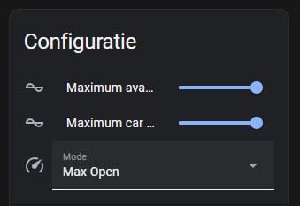
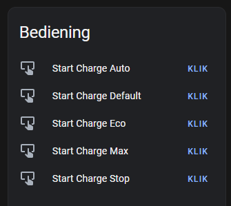

# ESPHome BLE Client for Powerdale Nexxtender EV Charger

This repository contains an ESPHome BLE client for interfacing with the Powerdale Nexxtender EV Charger. The client allows you to seamlessly integrate the Nexxtender charger with your ESPHome projects, enabling you to monitor and control the charger remotely via Bluetooth Low Energy (BLE). Additionally, it integrates smoothly with Home Assistant, providing a convenient interface for managing your Nexxtender charger within your home automation setup.

[](https://github.com/geertmeersman)
[](https://www.buymeacoffee.com/geertmeersman)
[](https://discord.gg/PTpExQJsWA)

[](https://github.com/geertmeersman/nexxtender/blob/master/LICENSE)
[](https://github.com/geertmeersman/nexxtender/commits)
[](https://github.com/geertmeersman/nexxtender/graphs/contributors)
[](https://github.com/geertmeersman/nexxtender/commits/main)

[](https://github.com/geertmeersman/nexxtender/actions/workflows/esphome_build.yaml)

## Features

- **BLE Connectivity:** Establish a BLE connection between your ESPHome device and the Powerdale Nexxtender EV Charger for data exchange and control.

- **Real-time Monitoring:** Retrieve real-time data from the Nexxtender charger, including charging status, voltage, current, and power consumption.

- **Remote Control:** Control the Nexxtender charger remotely from your ESPHome device, enabling features such as starting, stopping, change charge mode, set the charger to Open/Private, set the maximum car charging speed and scheduling charging sessions.

- **Home Assistant Integration:** Seamlessly integrate the ESPHome BLE client with Home Assistant, allowing you to monitor and control the Nexxtender charger through the Home Assistant interface.

## Screenshots

### Lovelace card


### Change charger config



### Controls



### Sensors


### Diagnostics


## Table of contents

- [ESPHome BLE Client for Powerdale Nexxtender EV Charger](#esphome-ble-client-for-powerdale-nexxtender-ev-charger)
  - [Features](#features)
  - [Screenshots](#screenshots)
    - [Lovelace card](#lovelace-card)
    - [Change charger config](#change-charger-config)
    - [Controls](#controls)
    - [Sensors](#sensors)
    - [Diagnostics](#diagnostics)
  - [Table of contents](#table-of-contents)
  - [Getting Started](#getting-started)
    - [Finding Nexxtender Bluetooth MAC Address with NRF Connect App](#finding-nexxtender-bluetooth-mac-address-with-nrf-connect-app)
    - [Installing \& Configuring ESPHome](#installing--configuring-esphome)
      - [Customizing ESP32 Configuration (Optional)](#customizing-esp32-configuration-optional)
  - [Integrating ESPHome Devices with Home Assistant](#integrating-esphome-devices-with-home-assistant)
  - [Contributing](#contributing)
  - [License](#license)
  - [Support](#support)

## Getting Started

To integrate the ESPHome BLE client with your Powerdale Nexxtender EV Charger and Home Assistant, follow these steps:

### Finding Nexxtender Bluetooth MAC Address with NRF Connect App

Before integrating your Nexxtender EV Charger with the ESPHome BLE client, you'll need to find its Bluetooth MAC address. You can do this using the NRF Connect app, available for both Android and iOS devices. Follow these steps:

1. **Download and Install NRF Connect**: Go to the Google Play Store (for Android) or the Apple App Store (for iOS) and search for "NRF Connect." Download and install the app on your mobile device.

2. **Open NRF Connect**: Launch the NRF Connect app on your mobile device.

3. **Scan for BLE Devices**: In the NRF Connect app, navigate to the "Scanner" tab and start scanning for nearby Bluetooth devices.

4. **Locate Nexxtender EV Charger ("HOME")**: The charger's Bluetooth module should broadcast its presence with the name "HOME," allowing NRF Connect to detect it.

5. **View Device Details**: Once NRF Connect detects the Nexxtender EV Charger, tap on it to view its details. Among the information displayed, you'll find the Bluetooth MAC address (also known as the BD_ADDR) of the charger.

6. **Note MAC Address**: Make a note of the Bluetooth MAC address of your Nexxtender EV Charger. You'll need this MAC address when configuring the ESPHome BLE client.

By following these steps, you can easily find the Bluetooth MAC address of your Nexxtender EV Charger named "HOME" using the NRF Connect app.

### Installing & Configuring ESPHome

1. **Install ESPHome:** If you haven't already, install ESPHome by following the instructions [here](https://esphome.io/guides/getting_started_command_line.html#installation-step).

2. **Create a new ESPHome Configuration:** Create a new file named `nexxtender.yaml` in your local directory. Copy and paste the contents of the provided `nexxtender.yaml` into this file (or copy/paste the below yaml).

   ```yaml
   packages:
      nexxtender: 
         url: https://github.com/geertmeersman/nexxtender
         file: config/nexxtender.yaml
         refresh: 0s
   substitutions:
      device_name: nexxtender
      friendly_name: Nexxtender
      ## Uncomment and modify when you want to use a different threshold.
      # charging_mode_eco_threshold: "8"      # Single phase (6A + 2 margin)
      # charging_mode_eco_bi_threshold: "14"  # Bi-phase (12A + 2 margin)
      # charging_mode_eco_tri_threshold: "20" # Tri-phase (18A + 2 margin)
      # slider_max_car_charging_speed: "32"     # The max value of the slider for the maximum car charging speed slider
   ```

   The charging power mode is estimated based on the number of phases used during the charge.  
   The substitution `charging_mode_eco_threshold` and the others are optional, and you can set it to whatever Amp you want to be used as a threshold for the ECO/MAX sensor.  
   The substitution `slider_max_car_charging_speed` lets you set the maximum value for the configuration slider of the maximum car charging speed slider. This is usually set to the value of the circuit breaker A.  
   Attention, it does not influence your charger; it is just a way of indicating which speed the charger is delivering.

3. **Update the secrets.yaml:**

   Ensure that your `secrets.yaml` file contains the following entries:

   ```yaml
   esphome_admin_password: "YOUR_ESPHOME_ADMIN_PASSWORD"
   wifi_ssid: "YOUR_WIFI_SSID"
   wifi_password: "YOUR_WIFI_PASSWORD"
   esphome_api_key: "YOUR_ESPHOME_API_KEY"
   nexxtender_mac: "YOUR_NEXXTENDER_MAC_ADDRESS"
   nexxtender_passkey: "YOUR_NEXXTENDER_PASSKEY"
   ```

   Replace `"YOUR_ESPHOME_ADMIN_PASSWORD"`, `"YOUR_WIFI_SSID"`, `"YOUR_WIFI_PASSWORD"`, `"YOUR_ESPHOME_API_KEY"`, `"YOUR_NEXXTENDER_MAC_ADDRESS"`, and `"YOUR_NEXXTENDER_PASSKEY"` with your actual values.

   The `nexxtender_mac` is the bluetooth mac address you found in the previous step.

   The `nexxtender_passkey` is the PIN code you use to pair your Nexxtender. If you don't have the PIN code (or you have lost it), you can always reach out to me and I can calculate it if you provide me the serial number of the box. Format XXXXX-XX-XXXX-XXXXX-XX

   The `esphome_admin_password` is the password that is used for the Wi-Fi fallback hotspot and OTA.

   If you don't know how to define the `esphome_api_key`, you can obtain one as described [here](https://esphome.io/components/api.html) in the section Configuration variables > encryption > key.

4. **Compile Firmware:** Compile the ESPHome firmware using the `nexxtender.yaml` configuration file. Run the following command in your terminal, pointing to the location of your `nexxtender.yaml` file:

   ```bash
   esphome compile nexxtender.yaml
   ```

5. **Flash Firmware:** Flash the compiled firmware to your ESPHome device using the following command:

   ```bash
   esphome upload nexxtender.yaml
   ```

   Note: If you’re just seeing Connecting....____.... on the screen and the flashing fails, please double-check the UART wires are connected correctly if flashing using a USB to UART bridge.

   For some devices you need to keep pressing the BOOT button until flashing has begun (i.e. Geekcreit DOIT ESP32 DEVKIT V1).

   [Consult the FAQ part on esphome.io](https://esphome.io/guides/faq.html).

6. **Integrate with Home Assistant:** In your Home Assistant configuration, add the ESPHome device as a new integration. Follow the instructions provided by Home Assistant to discover and integrate the Nexxtender charger with your Home Assistant setup.

7. **Monitor Logs:** Monitor the ESPHome device logs to ensure that the BLE client establishes a connection with the Powerdale Nexxtender EV Charger successfully.

8. **Test Functionality:** Test the functionality of the ESPHome BLE client by monitoring real-time data from the Nexxtender charger and controlling its operation remotely from your ESPHome device or through the Home Assistant interface.

#### Customizing ESP32 Configuration (Optional)

If you want to customize the ESP32 section in your `nexxtender.yaml` file for your specific board type, you can add the following section at the end of the nexxtender.yaml:

```yaml
esp32:
  board: YOUR_ESP32_BOARD_TYPE
```

Replace `YOUR_ESP32_BOARD_TYPE` with the specific board type you're using, such as `az-delivery-devkit-v4` or any other compatible board.

Example for the ESP32-S3-N16R8, buy here: [Aliexpress](https://a.aliexpress.com/_EwvIgjF)

```yaml
esp32:
  board: esp32-s3-devkitc-1

esphome:
  platformio_options:
    board_build.flash_mode: dio  
```

For this specific board, I have created a specific yaml that manages the RGB LED that is integrated on the board.

The complete configuration file would look like:

   ```yaml
   packages:
      nexxtender: 
         url: https://github.com/geertmeersman/nexxtender
         files:  [config/nexxtender.yaml, config/nexxtender_packages/esp.s3.yaml]
         refresh: 0s
   substitutions:
      device_name: nexxtender
      friendly_name: Nexxtender
   ```

This flexibility allows users to tailor the configuration to their hardware requirements while still benefiting from the overall structure and functionality provided in the `nexxtender.yaml` file.

## Integrating ESPHome Devices with Home Assistant

To integrate ESPHome devices with Home Assistant, follow these steps:

1. **Prerequisites**: Ensure you have the ESPHome integration enabled in Home Assistant. You can do this by navigating to Configuration -> Integrations, clicking the "+" button to add an integration, searching for "ESPHome," and following the instructions to set it up.

2. **Discover ESPHome Devices**: After enabling the integration, Home Assistant will automatically discover ESPHome devices on your network. If your devices don't show up automatically, you can add them manually by providing their IP address and API key.

3. **Configuration YAML**: You can also configure ESPHome devices manually by adding them to your Home Assistant configuration YAML file. This allows for more advanced configuration options and customization.

4. **View Devices**: Once your ESPHome devices are discovered or added manually, you can view and manage them in the Home Assistant UI. This includes monitoring their status, viewing sensor data, and controlling their actions.

5. **Integrate with Automations**: You can use ESPHome devices in your Home Assistant automations to trigger actions based on sensor readings, device status changes, or other events.

6. **Customization**: Home Assistant allows for extensive customization of ESPHome devices, including renaming, grouping, and organizing them to fit your home automation setup.

7. **Updates and Maintenance**: Keep your ESPHome devices up to date by regularly checking for firmware updates and configuring automatic OTA updates if desired.

8. **Blueprint for zone automation**:
   Automate the switching of Nexxtender mode based on car entry or exit from a specified zone.

   This blueprint allows you to configure the device tracker for your car, the Nexxtender mode sensor, the mode selector, the zone where the Nexxtender is located, the desired Nexxtender mode, and the trigger event for zone entry or exit.

   [](https://my.home-assistant.io/redirect/blueprint_import/?blueprint_url=https%3A%2F%2Fgithub.com%2Fgeertmeersman%2Fnexxtender%2Fblob%2Fmain%2Fblueprints%2Fnexxtender_car_zone.yaml)

   

9. **Lovelace dashboard card**:

   
   

   <details><summary>Show markdown code</summary>

   The example uses the following custom lovelace cards:

   - [button-card](https://github.com/custom-cards/button-card)
   - [card-mod](https://github.com/thomasloven/lovelace-card-mod)
   - [vertical-stack-in-card](https://github.com/ofekashery/vertical-stack-in-card)

   The images used are available in the images folder of this repository.

   In the example below they are located in your HA /config/www/images/auto/ folder.

   ```yaml
    type: custom:vertical-stack-in-card
    cards:
      - type: picture-elements
        aspect_ratio: 2
        elements:
          - style:
              top: 50px
              left: 73%
            show_name: false
            show_icon: false
            type: custom:button-card
            entity: sensor.nexxtender_connection_type
            show_state: true
            styles:
              card:
                - background: none
                - border-radius: 0
                - border: 0
                - font-size: 12px
                - color: black
          - style:
              top: 65px
              left: 73%
            show_name: true
            name: |
              [[[ return entity.state+" fasen"; ]]] 
            show_icon: false
            type: custom:button-card
            entity: sensor.nexxtender_charging_phases
            show_state: false
            styles:
              card:
                - background: none
                - border-radius: 0
                - border: 0
                - font-size: 12px
                - color: black
          - style:
              top: 110px
              left: 70%
            show_name: true
            name: Pieklimiet
            layout: name_state
            show_icon: false
            type: custom:button-card
            entity: sensor.nexxtender_peak_consumption_limit
            show_state: true
            styles:
              card:
                - background: none
                - border-radius: 0
                - border: 0
                - font-size: 12px
                - color: black
          - style:
              top: 130px
              left: 70%
            show_name: true
            name: Beschikbaar
            layout: name_state
            show_icon: false
            type: custom:button-card
            entity: sensor.nexxtender_available_capacity
            show_state: true
            styles:
              card:
                - background: none
                - border-radius: 0
                - border: 0
                - font-size: 12px
                - color: black
          - style:
              top: 192px
              left: 70%
            show_name: false
            show_icon: false
            type: custom:button-card
            entity: sensor.nexxtender_mode
            show_state: true
            styles:
              card:
                - background: none
                - border-radius: 0
                - border: 0
                - font-size: 12px
                - color: black
          - name: L1
            style:
              top: 220px
              left: 65%
            show_name: true
            show_icon: false
            type: custom:button-card
            entity: sensor.nexxtender_grid_l1
            show_state: true
            styles:
              card:
                - background: none
                - border-radius: 0
                - border: 0
                - font-size: 10px
          - name: L2
            style:
              top: 220px
              left: 73%
            show_name: true
            show_icon: false
            type: custom:button-card
            entity: sensor.nexxtender_grid_l2
            show_state: true
            styles:
              card:
                - background: none
                - border-radius: 0
                - border: 0
                - font-size: 10px
          - name: L3
            style:
              top: 220px
              left: 81%
            show_name: true
            show_icon: false
            type: custom:button-card
            entity: sensor.nexxtender_grid_l3
            show_state: true
            styles:
              card:
                - background: none
                - border-radius: 0
                - border: 0
                - font-size: 10px
        image: /local/images/1x1.png
        card_mod:
          style: |
            ha-card {
              
              
                
              
                
              
                
              
                
              
              background-size: 100% 100%;
              background-image: url(/local/images/auto/device_home_{{image}}.png);
              height: 300px !important;
              border-radius: 0;
              margin: 0;
            }
      - type: conditional
        conditions:
          - condition: numeric_state
            entity: sensor.nexxtender_charging_phase_count
            above: 0
        card:
          type: picture-elements
          elements:
            - type: state-icon
              entity: sensor.nexxtender_energy
              style:
                top: 25px
                left: 10%
            - type: state-label
              entity: sensor.nexxtender_energy
              style:
                top: 25px
                left: 30%
            - type: state-label
              entity: sensor.nexxtender_charging_seconds
              style:
                top: 25px
                left: 50%
            - type: state-label
              entity: sensor.nexxtender_car_power
              style:
                top: 25px
                left: 70%
            - type: state-label
              entity: sensor.nexxtender_charging_phase_count
              suffix: ' fases'
              style:
                top: 25px
                left: 90%
          image: /local/images/1x1.png
          card_mod:
            style: |
              ha-card {
                height: 50px !important;
                background-color: #325FA8;
              }
      - type: conditional
        conditions:
          - condition: state
            entity: sensor.nexxtender_status
            state: Plugged
        card:
          type: horizontal-stack
          cards:
            - show_name: true
              show_icon: true
              icon: mdi:speedometer-slow
              type: custom:button-card
              layout: icon_name
              tap_action:
                action: toggle
              entity: button.nexxtender_start_charge_eco
              name: ECO laden
              styles:
                card:
                  - background: green
                  - border-radius: 0
                  - height: 50px
            - show_name: true
              show_icon: true
              icon: mdi:speedometer
              type: custom:button-card
              layout: icon_name
              tap_action:
                action: toggle
              entity: button.nexxtender_start_charge_max
              name: MAX laden
              styles:
                card:
                  - background: blue
                  - border-radius: 0
                  - height: 50px
      - type: conditional
        conditions:
          - condition: state
            entity: sensor.nexxtender_status
            state: Charging
        card:
          show_name: true
          show_icon: false
          type: custom:button-card
          icon: mdi:stop
          tap_action:
            action: toggle
          entity: button.nexxtender_stop_charging
          name: Stop met laden
          styles:
            card:
              - background: '#8E8D92'
              - border-radius: 0
              - height: 50px
      - type: conditional
        conditions:
          - condition: state
            entity: sensor.nexxtender_status
            state: Unplugged
        card:
          type: markdown
          content: <center>Sluit de kabel aan om te kunnen starten met laden</center>
      - type: history-graph
        entities:
          - entity: sensor.nexxtender_grid_l1
          - entity: sensor.nexxtender_grid_l2
          - entity: sensor.nexxtender_grid_l3
        logarithmic_scale: false

   ```

   </details>

## Contributing

Contributions to the ESPHome BLE client for Powerdale Nexxtender EV Charger are welcome! Whether you want to report a bug, request a feature, or contribute code, your input is valuable to the community. Please refer to the [Contribution Guidelines](CONTRIBUTING.md) for more information.

## License

This project is licensed under the MIT License. See the [LICENSE](LICENSE) file for details.

## Support

For support, questions, or feedback, please open an issue on the [GitHub repository](https://github.com/geertmeersman/nexxtender/issues/new).
